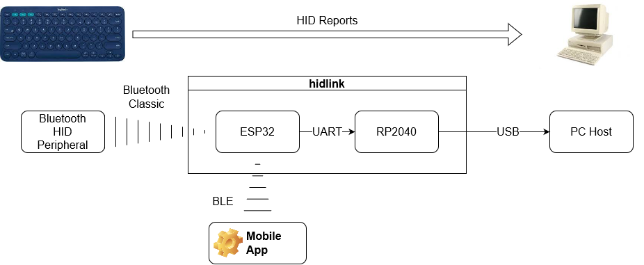
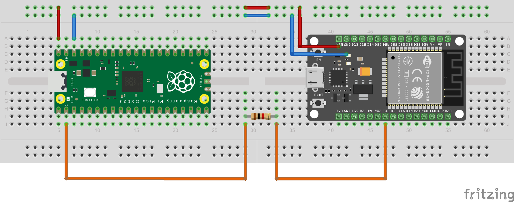

# hidlink

DIY hardware that links a Bluetooth keyboard to an USB port.

Useful when you want a Bluetooth keyboard to be available during boot time on desktop computers (BIOS or dual-boot selection).

Based on ESP32 and Raspberry Pi Pico.

# Table of contents

<!--ts-->
* [Introduction](#introduction)
* [Set-up](#set-up)
  * [ESP32 Set-up](#esp32-set-up)
  * [Raspberry Pi Pico Set-up](#raspberry-pi-pico-set-up)
* [Hardware](#hardware)
  * [Breadboard](#breadboard)
  * [PCB](#pcb)
* [Protocols](#protocols)
  * [Bluetooth Low Energy](#bluetooth-low-energy)
    * [Advertising](#advertisement-packet)
    * [Device Name](#device-name)
    * [GATT Server](#gatt-server)
    * [hidlink BLE Protocol](#hidlink-ble-protocol)
  * [UART](#uart)
    * [hidlink UART Protocol](#hidlink-uart-protocol)
* [Development](#development)
  * [ESP32 Development](#esp32-development)
  * [Raspberry Pi Pico Development](#raspberry-pi-pico-development)
<!--te-->


# Introduction



Layout made with [diagrams.net](https://diagrams.net/).

* **Bluetooth Low Energy** ``BLE``: used for selecting which Bluetooth HID will be used via the mobile app.
* **Bluetooth Classic** ``BR/EDR``: used to interact to HID peripherals. It scans nearby Bluetooth HID peripherals. Once one device is choosen by the mobile app, ``hidlink`` will keep connected to it.
* **UART**: used to send HID reports (ie. keyboard strokes) from ESP32 to Raspberry Pi Pico, which in turn send these reports to PC via USB HID interface.
* **USB HID**:

[Back to top](#table-of-contents)

# Set-up 

[Back to top](#table-of-contents)

## ESP32 Set-up

[Back to top](#table-of-contents)

## Raspberry Pi Pico Set-up

[Back to top](#table-of-contents)

# Hardware

[Back to top](#table-of-contents)

## Breadboard



Layout made with [Fritzing](https://fritzing.org/).

* Power and USB communication are plugged via the **Raspberry Pi Pico** board (micro USB cable).
  * **ESP32-DevKitV1** ``VIN`` connects to **Raspberry Pi Pico** ``VBUS``.
  * **ESP32-DevKitV1** ``GND`` connects to **Raspberry Pi Pico** ``GND``.
* **ESP32-DevKitV1** board is powered via the ``RED`` and ``BLUE`` wires.
* Communication between **ESP32-DevKitV1** and **Raspberry Pi Pico** is made via the orange wire:
  * **ESP32-DevKitV1** ``U2_TXD`` connects to **Raspberry Pi Pico** ``UART0 RX``.
  * The 1K resistor is not really needed, but is advisable to avoid damage to the digital pins due electromagnetic induction.
  

[Back to top](#table-of-contents)

## PCB

[Back to top](#table-of-contents)

# Protocols

[Back to top](#table-of-contents)

## Bluetooth Low Energy

### Advertisement packet
``02 01 06 08 09 68 69 64 6c 69 6e 6b``

### Device name
``hidlink``

[Back to top](#table-of-contents)

### GATT Server

#### CDTP - Custom Data Transfer Profile

* Service UUID: ``59534241-ef18-4d1f-850e-b7a87878dfa0`` 
  * Data characteristic UUID: ``59534241-ef18-4d1f-850e-b7a87878dfa1``
    * Requests are performed by:
      * Writing to this characteristic
    * Responses are received by:
      * Reading to this characteristic or 
      * Receiving indications from this characteristic
      * Receiving notifications from this characteristic
    * Requests end responses follow the **hidlink BLE Protocol** described [below](#hidlink-ble-protocol).

[Back to top](#table-of-contents)

### hidlink BLE Protocol

#### Frame pattern
``header`` ``command`` ``len`` ``data`` ``checksum``
* ``header``
  * Packet start marker
  * Length: 1 byte
  * Fixed ``0x3e`` for request
  * Fixed ``0x3c`` for reponse
* ``command``
  * Command code
  * Length: 1 byte
  * See available codes [below](#commands)
* ``len``
  * Length of ``data`` field in bytes
  * Length: 1 byte
* ``data``
  * Data field
  * Length: Value of ``len`` bytes
* ``checksum``
  * Two's complement of the 8 bit truncated sum of all previous fields
  * Suming all bytes of all fields to ``checksum`` value must result in ``0x00`` for a valid packet

#### Commands

##### 0x01 Get HIDLINK Status
Returns the current status of HIDLINK device.
* Request: ``0x3e`` ``0x01`` ``0x00`` ``0xc1``
* Response: ``0x3c`` ``0x01`` ``0x01`` ``status`` ``checksum``
  * ``status``
    * ``0x01`` NOT CONNECTED
    * ``0x02`` SCANNING
    * ``0x03`` CONNECTED
    * ``0x04`` ERROR ESP32
    * ``0x05`` ERROR RP2040
##### 0x02 Start peripheral scan
Starts scanning of nearby peripherals. The scanning process lasts for 10 seconds. Whenever a scan process is started, the list of scanned devices previously is cleared prior to the new scanning start.
* Request: ``0x3e`` ``0x02`` ``0x00`` ``0xc0``
* Response: ``0x3c`` ``0x02`` ``0x01`` ``ack`` ``checksum``
  * ``ack``
    * ``0x06`` SUCCESS
    * ``0x15`` FAIL
##### 0x03 Stop peripheral scan
Stops scanning of peripherals if HIDLINK is in scanning mode. If not in scanning mode, this command has no effect. If there are any peripherals in the scanned devices list, the devices are kept and can be attached to.
* Request: ``0x3e`` ``0x03`` ``0x00`` ``0xbf``
* Response: ``0x3C`` ``0x03`` ``0x01`` ``ack`` ``checksum``
  * ``ack``
    * ``0x06`` SUCCESS
    * ``0x15`` FAIL
##### 0x04 Get scanned peripheral count
* Request: ``0x3e`` ``0x04`` ``0x00`` ``0xbe``
* Response: ``0x3c`` ``0x04`` ``0x01`` ``count`` ``checksum``
  * ``count``: Number of valid HID peripherals found during scanning process.
##### 0x05 Get scanned peripheral data by index
* Request: ``0x3e`` ``0x05`` ``0x01`` ``index`` ``checksum``
  * ``index``: Index of HID peripheral in scan list. Starts in 1. Maximum value is ``count`` from command ``0x04``.
* Response: ``0x3c`` ``0x05`` ``len`` ``address`` ``name`` ``checksum``
  * ``len``: Data field lend in bytes (1 byte)
  * ``address``: HID peripheral MAC address (6 bytes)
  * ``name``: HID peripheral name (``len`` - 6 bytes)
##### 0x06 Attach to peripheral by index
* Request: ``0x3e`` ``0x06`` ``0x01`` ``index`` ``checksum``
  * ``index``: Index of HID peripheral in scan list. Starts in 1. Maximum value is ``count`` from command ``0x04``.
* Response: ``0x3c`` ``0x06`` ``0x01`` ``ack`` ``checksum``
  * ``ack``
    * ``0x06`` SUCCESS
    * ``0x15`` FAIL
##### 0x07 Get attached peripheral info
* Request: ``0x3e`` ``0x07`` ``0x00`` ``0xbb``
* Response: ``0x3c`` ``0x07`` ``len`` ``address`` ``name`` ``checksum``
  * ``len``: Data field lend in bytes (1 byte)
  * ``address``: HID peripheral MAC address (6 bytes)
  * ``name``: HID peripheral name (``len`` - 6 bytes)
##### 0x08 Unattach peripheral
* Request: ``0x3e`` ``0x08`` ``0x00`` ``0xba``
* Response: ``0x3c`` ``0x08`` ``0x01`` ``ack`` ``checksum``
  * ``ack``
    * ``0x06`` SUCCESS
    * ``0x15`` FAIL

[Back to top](#table-of-contents)

## UART

[Back to top](#table-of-contents)

### hidlink UART Protocol

[Back to top](#table-of-contents)

# Development

[Back to top](#table-of-contents)

## ESP32 Development

[Back to top](#table-of-contents)

## Raspberry Pi Pico Development

### Linux
* Install system packages
  ```sh
  sudo pacman -S cmake arm-none-eabi-gcc arm-none-eabi-binutils arm-none-eabi-newlib arm-none-eabi-gdb
  ```
* Get ``pico-sdk`` repository
  ```sh
  cd ~
  git clone https://github.com/raspberrypi/pico-sdk
  cd pico-sdk
  git checkout 1.5.1
  git submodule update --init --recursive
  ```
* Configure ``cmake``
  ```sh
  cd [path_where_hidlink_repo_is]/hidlink/firmware_rp2040
  mkdir build
  cmake -DPICO_SDK_PATH=/home/[user_name]/pico-sdk -B build -GNinja
  ```
* Build
  ```sh
  ninja -C build
  ```
The generated files will be available at the ``build`` dir. The file with ``uf2`` extension can be loaded directly into the USB drive of the Raspberry Pi Pico board.

[Back to top](#table-of-contents)

